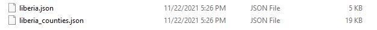

# liberian_water_access


## Table of Contents 
1. Introduction
2. Workflow 
3. Webmapping
4. Conclusion
   


This project aims to map out internal water access in Liberia from data collected by the Liberian Water Point Data provided by the Akvo Foundation, a not-for-profit foundation that creates open source internet and mobile software sensors working towards collaborative development efforts in the fields of water, sanitation, agriculture, health, energy and other fields around the world. This particular dataset seeks to map out access points water and provide information about drinking pump status, fecal content, provider, and other useful information. 

The project will utilize npm scripts through Node.js to configure analysis on the front and backends. The workflow process will be demonstrated in Chapter 2, followed by a webmapping process that consists of Chapter 3. Data collected for this project is outlined here:

1. Liberia Water Point Data - https://data.humdata.org/dataset/liberia-water-point-data

2. Soveriegnty/Provinces/Urban Areas Shapefiles - https://www.naturalearthdata.com/downloads/10m-cultural-vectors/10m-admin-1-states-provinces/

This project seeks to produce geoprocessing analysis solely through npm packages - particularly turf.js. 

## <b>Chapter 2: Workflow </b>

After downloading all of our necessary files, extracting them into subdirectories within the repo, and some initial readme commits, let's begin by utilizing mapshaper to trim down our vector shapefiles for Liberia including the sovereignty boundary, provinces, and urban areas. We'll work primarily through the command line to achieve these goals. Afterwards, we'll move into the Liberian Water Point dataset to do some processing on the front and backends in subtopics within this chapter. 
 
 ### <b> Chapter 2.2 - Mapshaper Processing. </b>

 Let's start from the outside working in. First, I'll begin by getting info about the sovereignty, provinces, and urban areas shapefiles downloaded from Natural Earth:

 ```
 $ mapshaper sovereignty.shp -info
 ```
```
$ mapshaper provinces.shp -info
```
```
$ mapshaper urban_areas.shp -info
```

Ok great!

Now we can start to see what fields we'd like to keep as well as begin to filter features and other things to trim down our boundary files. Let's start with the sovereignty of Liberia:

```
$ mapshaper ne_10m_admin_0_countries.shp -filter "ADMIN=='Liberia'" -simplify dp 15% -o format=geojson liberia.json
```
<b> mapshaper tip: </b> When selecting features, be sure the syntax is as follows -  'field == "feature"' 

We can go ahead and do this for our other shapefiles for counties.

<b> Counties:

```
$ mapshaper ne_10m_admin_1_states_provinces.shp -filter "admin=='Liberia'" -filter-fields admin,name,latitude,longitude,name_en  -simplify dp 15% -o format=geojson liberia_counties.json
```
</b>

When we check our created JSON files, we'll see that they're of exceptional trimming perfect for webmapping. We'll come back to these files later when we're ready to start the web map process. 



Now, let's turn to using npm to convert our csv to geojson for a webmapping format.

### <b>Chapter 2.3 - Convert Large CSV Data to Geojson </b>

We'll begin by doing an initial backend script to create a GeoJSON file out of the rather large Liberian Water Access data file. In order to begin our geoprocess with turf, we'll need to create a file that uses the lat/lon fields as our custom geometry. We can see that there is some initial formatting of the csv that needs to be modified so that the structure is sound. Remove 'sep=' that is in the first line of the csv file. 

Next, I've created a new script within the build-scripts directory called <i>liberia_water_points.js.</i>

```
$ type nul> liberia_water_points.js
```

We'll need to load some npm packages into our package manager to write out our program. Install the following packages:

```
$ npm install chalk
$ npm install csv2geojson
$ npm install @turf/turf
$ npm install fs
```

See the <i>liberia_water_points.js </i> script to see how I converted the csv data to geojson. The output file gives us a 21MB point data file that is absurdly too large to use for any webmapping purposes. Before we continue with using turf, let's try to trim it down with Mapshaper to make it somewhat lighter. 

```
$ mapshaper liberia_water.json -filter-fields adm1,adm2,count,data_lnk,fecal_coliform_presence,fecal_coliform_val
ue,install_year,installer,location,management,pay,photo_lnk,report_date,source,status,status_id,water_source,water_tech -simplify dp 15% -o force liberia_water.json
```

We were able to trim it down somewhat, but the file is still very large. We'll remedy this later with some node in the backend later in the chapter to account for a more attainable webmapping goal. 

### <b>Chapter 2.4 - Frontend Turf Script #1 - Buffer of Roads</b>

Our first front-end script with turf will be to buffer the roads by 1/10th of a kilometer on either side of road centerlines. The tenth of kilometer was chosen just as a quick simulation for easy walkable access to nearby water pumps that can be accessed from the road. The idea that is working here is to find out how many of these pumps actually fall within a distance of road accessibility.

To start this process, we'll first need to convert our roads topoJSON file into a geojson format. Write the following code:
```
var geojson = topojson.feature(roads, roads.objects.roads3);

    var roadLayer = L.geoJson(geojson, {
      style: function(feature, layer) {
        return {
          color: 'black', 
          weight: 2
        };
      }
    }).addTo(map)
```

This creates our Leaflet GeoJson layer that can be directly added to the map. Next, in order to run a turf geoprocessing task on the roads, we need to convert the Leaflet GeoJson layer into a regular <i>GeoJSON</i> layer.

Write out this code:

```
roadLayer.eachLayer(function(layer) {
      
var roadFeature = layer.toGeoJSON();

var buffered = turf.buffer(roadFeature, .1, {units: "kilometers"})
```

The roadLayer Leaflet geoJson object is converted here into a regular <i>GeoJSON</i> object and is then buffered using the <i>turf.buffer</i> method. 

